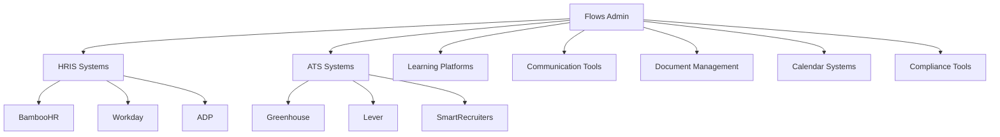

# Recent Findings & Future Plans
*Updated: 2025-01-27*

## 🔍 Recent Findings & Insights

### Database Schema Evolution
**Finding**: The database schema has evolved significantly but with some inconsistencies:
- Employee status constraint now supports `active`, `previous`, `future`, `other` 
- New `employee_app_enrollments` table for proper KPI tracking
- Tasks can now be associated with specific applications (`app_id`)
- JWT tokens support optional association dates

**Gap**: The UI transformations still include legacy mapping logic that could be simplified once the schema is fully migrated.

### UX/UI Pattern Inconsistencies
**Finding**: Navigation patterns are inconsistent:
- Some buttons use `href` (which breaks in dev mode for sub-routes)
- Others use programmatic `goto()` navigation
- Mix of direct routing vs. dashboard-centric navigation

**Impact**: Users experience 404s when navigating directly to `/employees` or other sub-routes.

### Error Reporting Evolution
**Finding**: Error reporting has evolved from simple logging to a comprehensive monitoring system:
- Started as inline card component
- Now floating status button with rich popover
- Foundation laid for performance monitoring, auth status, service workers

**Opportunity**: The floating status system could become a powerful development tool hub.

### Invitation Management Maturity
**Finding**: Invitation system has grown from basic creation to full lifecycle management:
- Complete CRUD operations in UI
- Advanced filtering and search
- Status-aware action menus
- But lacking actual API integration for management operations

## 📋 Immediate Technical Debt

### 1. Navigation Architecture
```typescript
// Current inconsistent patterns:
<Button href="/employees">        // Breaks in dev mode
<Button on:click={() => goto('/')}>  // Works but inconsistent

// Proposed unified approach:
<Button route="/employees">       // Custom component handling dev mode
```

### 2. Database Schema Cleanup
- Remove legacy status mapping functions once schema is fully migrated
- Consolidate employee status handling
- Update database functions to use new `employee_app_enrollments` table

### 3. Missing API Integrations
- Invitation revoke/resend functionality (UI exists, backend missing)
- Employee deletion/archiving
- Bulk operations for invitations
- Real-time updates for invitation status changes

## 🚀 Undocumented Future Opportunities

### 1. Advanced Employee Lifecycle Management

**Current State**: Basic CRUD operations
**Vision**: Complete employee journey tracking

```typescript
interface EmployeeJourney {
  phases: {
    preboarding: {
      status: 'not_started' | 'in_progress' | 'completed';
      tasks: PreboardingTask[];
      completionDate?: Date;
    };
    onboarding: {
      status: 'not_started' | 'in_progress' | 'completed';
      checkpoints: OnboardingCheckpoint[];
      mentorAssigned?: string;
      completionDate?: Date;
    };
    employment: {
      status: 'active' | 'on_leave' | 'performance_plan';
      reviews: PerformanceReview[];
      promotions: Promotion[];
    };
    offboarding: {
      status: 'initiated' | 'in_progress' | 'completed';
      exitInterview?: ExitInterview;
      assetReturn: AssetReturnStatus[];
    };
  };
}
```

### 2. Real-Time Collaboration Features

**Finding**: Current system is single-user focused
**Opportunity**: Multi-admin collaboration

- **Live Updates**: Real-time invitation status changes
- **Activity Feed**: "John just created an invitation for Jane Smith"
- **Concurrent Editing**: Prevent conflicts when multiple admins work simultaneously
- **Audit Trail**: Detailed history of who did what when

### 3. Advanced Analytics & Insights

**Current**: Basic KPI counts (onboarding/offboarding)
**Vision**: Comprehensive workforce analytics

```typescript
interface WorkforceAnalytics {
  trends: {
    hiringVelocity: TrendData;
    onboardingEfficiency: TrendData;
    departmentGrowth: DepartmentTrend[];
    seasonalPatterns: SeasonalData;
  };
  predictions: {
    upcomingOffboarding: PredictedDeparture[];
    capacityForecast: CapacityPrediction[];
    skillGapAnalysis: SkillGap[];
  };
  benchmarks: {
    industryComparison: BenchmarkData;
    timeToProductivity: ProductivityMetrics;
    retentionRates: RetentionAnalysis;
  };
}
```

### 4. Integration Ecosystem

**Current**: Standalone system
**Vision**: Central hub for HR tech stack

- **HRIS Integration**: Sync with BambooHR, Workday, etc.
- **Calendar Integration**: Automatically schedule onboarding meetings
- **Communication Platform**: Slack/Teams notifications for status changes
- **Document Management**: Integration with DocuSign, Google Drive
- **Learning Management**: Connect with training platforms

### 5. Mobile-First Experience

**Finding**: Current design is desktop-focused
**Opportunity**: Mobile admin capabilities

- **Progressive Web App**: Offline capability for remote work
- **Push Notifications**: Critical status updates
- **Quick Actions**: Approve/revoke invitations from mobile
- **Voice Commands**: "Show me pending onboarding tasks"

## 🎯 Architectural Evolution Opportunities

### 1. Micro-Frontend Architecture

**Current**: Monolithic SvelteKit app
**Future**: Modular micro-frontends

```
/dashboard          - Overview & metrics
/employees          - Employee management
/invitations        - Invitation lifecycle
/analytics          - Reporting & insights
/integrations       - Third-party connections
/admin              - System administration
```

### 2. Event-Driven Architecture

**Current**: Direct database operations
**Future**: Event-sourced system

```typescript
// Events drive the system
events: {
  EmployeeHired,
  OnboardingStarted,
  TaskCompleted,
  InvitationExpired,
  DocumentUploaded,
  ReviewScheduled
}

// Each event updates multiple projections
projections: {
  EmployeeStatus,
  DepartmentMetrics,
  ComplianceTracking,
  AuditLog
}
```

### 3. AI-Powered Automation

**Opportunity**: Intelligent workflow automation

- **Smart Task Assignment**: AI suggests optimal task sequences
- **Predictive Alerts**: "Sarah's onboarding is likely to be delayed"
- **Document Intelligence**: Auto-categorize uploaded documents
- **Natural Language Queries**: "Show me all developers who joined last quarter"

## 📊 Performance & Scalability Findings

### Current Limitations Discovered

1. **Data Loading**: All employee data loaded at once (inefficient for large orgs)
2. **Search Performance**: Client-side filtering won't scale beyond ~1000 employees
3. **Real-time Updates**: No live updates when data changes
4. **Image Handling**: No avatar/document preview system
5. **Export Capabilities**: No data export for compliance/reporting

### Scalability Roadmap

```typescript
// Phase 1: Optimize Current System
- Implement pagination for large datasets
- Add server-side search and filtering
- Introduce data virtualization for long lists

// Phase 2: Performance Enhancements  
- Add caching layer (Redis)
- Implement optimistic updates
- Add background data synchronization

// Phase 3: Enterprise Scale
- Database sharding by client
- CDN for static assets
- Microservices architecture
```

## 🔐 Security & Compliance Gaps

### Discovered Security Considerations

1. **Audit Logging**: Limited tracking of admin actions
2. **Data Retention**: No automatic cleanup of old data
3. **Access Control**: Single admin role, no fine-grained permissions
4. **Data Encryption**: PII in JWT but not in database
5. **Session Management**: No concurrent session limits

### Compliance Framework Needed

```typescript
interface ComplianceFramework {
  gdpr: {
    dataProcessingAgreements: boolean;
    rightToErasure: boolean;
    dataPortability: boolean;
    consentManagement: boolean;
  };
  sox: {
    auditTrails: boolean;
    accessControls: boolean;
    dataIntegrity: boolean;
    changeManagement: boolean;
  };
  hipaa: {
    accessLogging: boolean;
    encryptionAtRest: boolean;
    encryptionInTransit: boolean;
    minimumNecessary: boolean;
  };
}
```

## 🎨 Design System Evolution

### Current UI/UX Findings

**Strengths**:
- Consistent component library (shadcn-svelte)
- Clean, professional aesthetic
- Good use of icons and visual hierarchy

**Gaps**:
- No dark mode support
- Limited accessibility testing
- No responsive design for mobile
- No design tokens for theming

### Future Design Vision

```typescript
// Advanced theming system
interface DesignSystem {
  themes: {
    light: ThemeTokens;
    dark: ThemeTokens;
    highContrast: ThemeTokens;
    companyBranded: ThemeTokens;
  };
  components: {
    animations: MotionSystem;
    spacing: SpacingScale;
    typography: TypographyScale;
    elevation: ShadowSystem;
  };
  accessibility: {
    colorContrast: AAA_COMPLIANCE;
    keyboardNavigation: WCAG_2_1;
    screenReader: ARIA_COMPLETE;
  };
}
```

## 📈 Business Intelligence Opportunities

### Data-Driven Insights Not Yet Captured

1. **Onboarding Effectiveness**:
   - Time-to-productivity by role
   - Drop-off points in onboarding process
   - Correlation between onboarding quality and retention

2. **Operational Efficiency**:
   - Admin time spent on manual tasks
   - Invitation-to-start conversion rates
   - Process bottlenecks identification

3. **Predictive Analytics**:
   - Flight risk identification
   - Optimal hiring timing
   - Resource planning forecasts

## 🔄 Integration Strategy Evolution

### Current State
- Standalone demo system
- Supabase for data persistence
- Manual data entry and management

### Future Integration Ecosystem



## 🎯 Prioritized Implementation Roadmap

### Q1 2025: Foundation Strengthening
1. Fix navigation architecture for dev/prod consistency
2. Implement real invitation management API calls
3. Add mobile-responsive design
4. Complete database schema migration

### Q2 2025: Enhanced User Experience
1. Real-time updates and notifications
2. Advanced search and filtering (server-side)
3. Bulk operations for invitations
4. Audit logging for compliance

### Q3 2025: Intelligence & Automation
1. Analytics dashboard with insights
2. Automated workflow suggestions
3. Integration framework foundation
4. Performance optimization

### Q4 2025: Enterprise Readiness
1. Multi-tenant architecture
2. Advanced security features
3. Compliance framework
4. Third-party integrations

## 💡 Innovation Opportunities

### Emerging Technology Integration

1. **AI-Powered Insights**:
   - Natural language queries: "Show me all remote developers hired in Q4"
   - Automated task generation based on role and department
   - Sentiment analysis of onboarding feedback

2. **Blockchain for Verification**:
   - Immutable audit trails for compliance
   - Verified credential management
   - Smart contracts for automated workflows

3. **IoT Integration**:
   - Badge access tracking for office onboarding
   - Equipment assignment and tracking
   - Workspace utilization analytics

## 📝 Documentation Gaps Identified

### Missing Documentation
1. **API Documentation**: Complete endpoint documentation
2. **Deployment Guide**: Production deployment procedures
3. **Integration Guide**: How to extend and integrate
4. **Troubleshooting Guide**: Common issues and solutions
5. **Performance Guide**: Optimization best practices

### Recommended New Documents
1. `ARCHITECTURE_DECISION_RECORDS.md` - Track major technical decisions
2. `INTEGRATION_COOKBOOK.md` - Step-by-step integration examples
3. `PERFORMANCE_OPTIMIZATION.md` - Scaling and optimization strategies
4. `SECURITY_CHECKLIST.md` - Security review checklist
5. `ACCESSIBILITY_GUIDELINES.md` - A11y implementation guide

## 🎉 Success Metrics & KPIs

### Technical Metrics
- **Performance**: Page load times < 2s, API response times < 500ms
- **Reliability**: 99.9% uptime, < 0.1% error rate
- **Scalability**: Support 10k+ employees per client
- **Security**: Zero data breaches, 100% audit compliance

### Business Metrics
- **User Satisfaction**: > 4.5/5 admin satisfaction score
- **Efficiency Gains**: 50% reduction in manual onboarding tasks
- **Process Improvement**: 30% faster time-to-productivity
- **Cost Savings**: 40% reduction in admin overhead

---

*This document represents current insights and future opportunities as of January 2025. It should be updated quarterly to reflect new findings and changing priorities.*